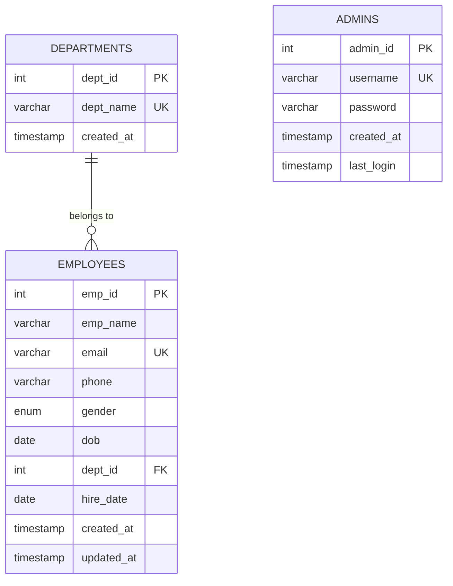
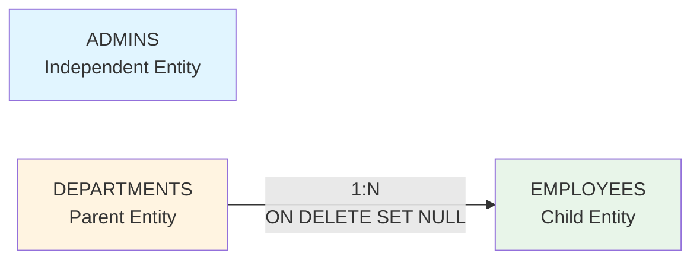

# Employee Management System - ER Diagram & Relationships

## Entity Relationship Diagram



## Entities and Attributes

### 1. **DEPARTMENTS**
| Attribute | Type | Constraints | Description |
|-----------|------|-------------|-------------|
| `dept_id` | INT | PRIMARY KEY, AUTO_INCREMENT | Unique department identifier |
| `dept_name` | VARCHAR(100) | NOT NULL, UNIQUE | Department name |
| `created_at` | TIMESTAMP | DEFAULT CURRENT_TIMESTAMP | Record creation timestamp |

**Indexes:**
- Primary Key on `dept_id`
- Unique constraint on `dept_name`

---

### 2. **EMPLOYEES**
| Attribute | Type | Constraints | Description |
|-----------|------|-------------|-------------|
| `emp_id` | INT | PRIMARY KEY, AUTO_INCREMENT | Unique employee identifier |
| `emp_name` | VARCHAR(100) | NOT NULL | Employee full name |
| `email` | VARCHAR(100) | NOT NULL, UNIQUE | Employee email address |
| `phone` | VARCHAR(20) | NULL | Contact number |
| `gender` | ENUM('M', 'F', 'Other') | DEFAULT 'M' | Gender |
| `dob` | DATE | NULL | Date of birth |
| `dept_id` | INT | FOREIGN KEY, NULL | Department reference |
| `hire_date` | DATE | NULL | Joining date |
| `created_at` | TIMESTAMP | DEFAULT CURRENT_TIMESTAMP | Record creation timestamp |
| `updated_at` | TIMESTAMP | ON UPDATE CURRENT_TIMESTAMP | Last update timestamp |

**Indexes:**
- Primary Key on `emp_id`
- Unique constraint on `email`
- Index on `dept_id` (for JOIN performance)
- Index on `email` (for search optimization)

---

### 3. **ADMINS**
| Attribute | Type | Constraints | Description |
|-----------|------|-------------|-------------|
| `admin_id` | INT | PRIMARY KEY, AUTO_INCREMENT | Unique admin identifier |
| `username` | VARCHAR(50) | NOT NULL, UNIQUE | Admin login username |
| `password` | VARCHAR(255) | NOT NULL | Bcrypt hashed password |
| `created_at` | TIMESTAMP | DEFAULT CURRENT_TIMESTAMP | Account creation timestamp |
| `last_login` | TIMESTAMP | NULL | Last login timestamp |

**Indexes:**
- Primary Key on `admin_id`
- Unique constraint on `username`
- Index on `username` (for login query optimization)

---

## Relationships

### 1. DEPARTMENTS → EMPLOYEES (One-to-Many)

**Relationship Type:** One-to-Many (Optional)

**Description:** 
- One department can have **multiple employees** (0 to many)
- One employee belongs to **at most one department** (0 or 1)

**Foreign Key:** 
- `employees.dept_id` references `departments.dept_id`

**Cardinality:**
- `DEPARTMENTS` : `EMPLOYEES` = **1 : N**

**Referential Actions:**
- **ON DELETE:** `SET NULL` - If a department is deleted, employees' `dept_id` is set to NULL (employees remain but become unassigned)
- **ON UPDATE:** `CASCADE` (default) - If department ID changes, employee records update automatically

**Business Rules:**
- Employees can exist without being assigned to a department (`dept_id` can be NULL)
- Each department must have a unique name
- When a department is removed, employees are not deleted but unassigned

---

### 2. ADMINS (Independent Entity)

**Relationship Type:** Independent

**Description:**
- Admins have **no direct relationship** with Departments or Employees in the schema
- They exist as a separate authentication entity for system access control

**Purpose:**
- Manages system authentication
- Controls access to employee management features
- No foreign key relationships with other tables

---

## Relationship Summary Diagram



---

## Key Constraints & Business Logic

### Referential Integrity
1. **Department Deletion:** Employees are not deleted when their department is removed; their `dept_id` becomes NULL
2. **Email Uniqueness:** No two employees can share the same email address
3. **Department Names:** All department names must be unique

### Indexes for Performance
- `idx_dept_id` on `employees.dept_id` - Optimizes JOIN operations
- `idx_email` on `employees.email` - Speeds up email lookups
- `idx_username` on `admins.username` - Accelerates login queries

### Data Quality Rules
- Employee names and emails are mandatory
- Gender defaults to 'M' if not specified
- Timestamps are automatically managed by MySQL
- `updated_at` automatically updates on any record modification

---

## Sample Queries Using Relationships

### Get all employees with department names
```sql
SELECT e.emp_id, e.emp_name, e.email, e.phone, 
       d.dept_name, e.hire_date
FROM employees e
LEFT JOIN departments d ON e.dept_id = d.dept_id
ORDER BY e.emp_id DESC;
```

### Get employee count per department
```sql
SELECT d.dept_name, COUNT(e.emp_id) as employee_count
FROM departments d
LEFT JOIN employees e ON d.dept_id = e.dept_id
GROUP BY d.dept_id, d.dept_name;
```

### Get employees without a department
```sql
SELECT emp_id, emp_name, email
FROM employees
WHERE dept_id IS NULL;
```

---

## Database Design Decisions

> [!NOTE]
> **Optional Department Assignment**
> 
> The `dept_id` is nullable to allow employees to exist in the system before being assigned to a department, providing flexibility during onboarding.

> [!IMPORTANT]
> **Soft Deletion Strategy**
> 
> When a department is deleted, employees are preserved with `dept_id = NULL` rather than being cascade-deleted, preventing accidental data loss.

> [!TIP]
> **Performance Optimization**
> 
> Strategic indexes on `dept_id` and `email` columns significantly improve query performance for the most common operations (JOINs and searches).
